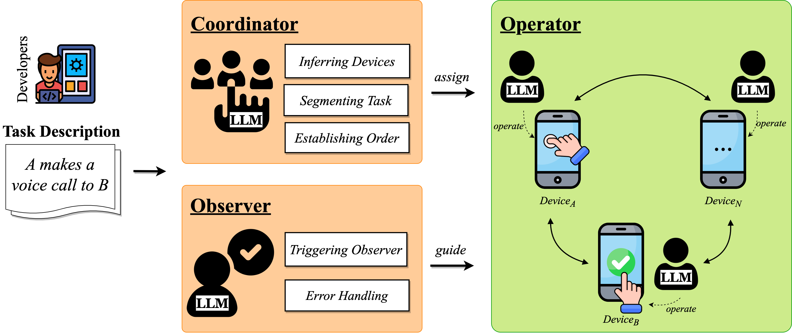
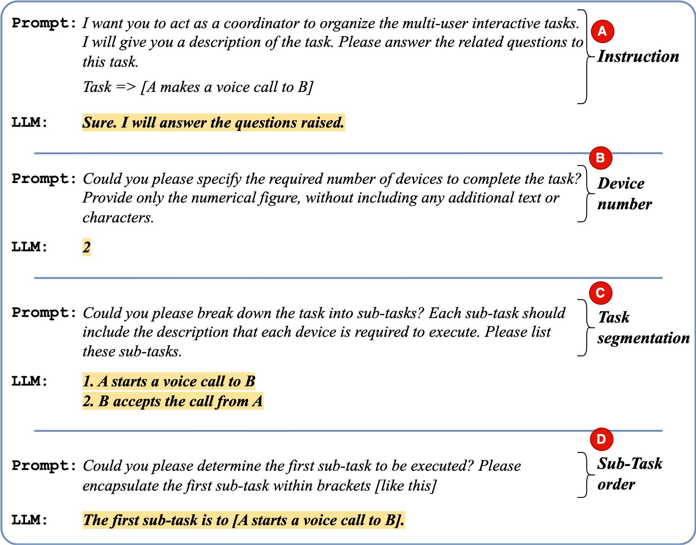
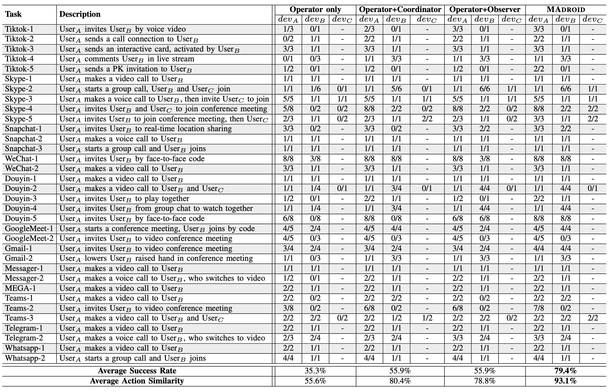

# Beyond a Single Tester: Multi-Agent LLMs for Testing Multi-User Interactive Features

## Table of Contents
- [Table of Contents](#table-of-contents)
- [Getting Started](#getting-started)
- [Definition of Multi-User Interactive Feature](#definition-of-multi-user-interactive-feature)
- [Approach](#approach)
    - [Coordinator](#coordinator)
    - [Operator](#operator)
    - [Observer](#observer)
- [Evaluation](#evaluation)
    - [RQ1: Performance of MADROID](#rq1-performance-of-madroid)
    - [RQ2: Comparison with State-of-the-Art](#rq2-comparison-with-state-of-the-art)
    - [RQ3: Usefulness of MADROID](#rq3-usefulness-of-madroid)

## Getting Started

 

Figure: Illustration of a group voice call.

The growing dependence on mobile phones and their apps has rendered multi-user interactive features, such as voice calls, live streaming, and video conferencing, crucial for overcoming physical and situational barriers in social networking. Nevertheless, the testing of these features poses substantial hurdles, as they require dynamic, collaborative, timely interactions among multiple users, which current automated testing methods inadequately address. 

Inspired by the concept of agents designed to autonomously and collaboratively tackle problems, we introduce MADROID, a novel dual multi-agent approach powered by the Large Language Models (LLMs) to automate the testing of multi-user interactive app features. In detail, MADROID introduces two distinct types of multi-agents: task agents (Operator) and methodology agents (Coordinator and Observer). Each agent takes a specific role: the Coordinator directs the interactive task; the Operator mimics user interactions on the device; and the Observer monitors and reviews the task automation process. 

## Definition of Multi-User Interactive Feature

Unlike the general features, the app’s multi-user interactive feature encompasses collaborative interactions that are responsive to inputs from multiple users. Consequently, in this section, we will first precisely define the problem associated with multi-user interactive features.

 

Figure: Multi-user interaction.

&nbsp;
&nbsp;

 

Figure: Multi-user interaction.

First, the feature enables users to interact with multiple users through the software. It can be a two-way or multi-way interaction between end-users. Note that interactions between a user and the software or the administrator are not categorized under multi-user interactive features, as such interactions are predominantly administrative and do not embody the peer-to-peer collaborative or communicative intent that is the hallmark of multi-user interactive features.

The second critical aspect of multi-user interaction is its timely nature. Interactions should occur with minimal delay, though not necessarily instantaneously, to maintain a fluid information exchange and keep users actively engaged. For example, when one user starts a voice call, the other should accept the call promptly to ensure effective communication. However, the capacity to test these features, especially concerning multi-user interactions with near real-time responses, is constrained within the existing automated testing tools.

## Approach

 

Figure: The overview of MADROID.

MADROID is designed with a dual multi-agent-based architecture, including task-oriented multi-agents (Operator) and methodology-oriented agents (Coordinator and Observer). 
Task agents are designed to mimic end-users, simulating multi-user interactions within the app environment, while methodology agents with distinct roles aim to enhance the execution of tasks.
In detail, the Coordinator directs the task; the Operator emulates the actions of interactive users; and the Observer reviews the task automation process.

> For more approach details and implementations, please check the instructions in [README.md](./approach)

### Coordinator

 

Figure: The example of prompting Coordinator.

The initial stage of our approach is to understand, analyze, organize, and strategize for prospective events derived from a high-level task description. This is achieved through the utilization of Large Language Models (LLMs) that draw upon training extensive resources such as tutorials and reports.
The *Coordinator* agent assumes the role of autonomous planner, which involves figuring out the number of required devices, partitioning the task into each device, and determining the task order.

### Operator

 

Figure: The example of prompting Operator.

Once the task coordination has been determined, we proceed by selecting the devices from the device farm, assigning them their sub-tasks, and establishing their initiation sequence. Subsequently, we deploy an individual *Operator* agent onto each device to navigate the GUI screen and fulfill the designated task.

### Observer

 

Figure: The example of prompting Observer.

Integrating LLMs for achieving interactive actions does not guarantee flawless inference of the desired outcomes. To mitigate these issues, similar to how professional developers carry out code reviews, we introduce an additional LLM agent acting as an external observer. This *Observer* agent periodically provides feedback based on a higher level of information.

## Evaluation

We describe the procedure we used to evaluate MADROID in terms of its performance.

- **RQ1:** How effective is our approach in automating multi-user interactive feature tasks?
- **RQ2:** How does our approach compare to the state-of-the-art methods?
- **RQ3:** How useful is our approach in real-world multi- user interactive feature testing?

For RQ1, we present the general performance of our approach in automating multi-user interactive tasks.
Moreover, we assess the impact of individual components within our approach by conducting an ablation study. 
For RQ2, we carry out experiments to check the effectiveness of our approach against three state-of-the-art baselines. 
For RQ3, we evaluate the usefulness of our approach to detect interactive bugs within real-world development environments.

> For more dataset details and experimental settings, please check the instructions in [README.md](./evaluation)

### RQ1: Performance of MADROID

Table: Detailed results for the multi-user interactive task, where dev denotes the device, and the actions are displayed in a format of #successfully-executed/#ground-truth.

Our approach achieves an average action similarity of 93.1%, successfully completing 79.4% of multi-user interactive tasks, which significantly surpasses the results of the ablation baselines. Operator only, achieves the worst performance, i.e., 35.3% success rate and 55.6% action similarity. 

The Coordinator agent (Operator+Coordinator) enhances the success rate of task automation by 20.6%, i.e., 55.9% vs 25.3% compared to Operator only. Furthermore, the Observer agent (Operator+Observer) demonstrates improvements of 23.2% in action similarity accuracy and 20.6% in success rate, compared with Operator only.

### RQ2: Comparison with State-of-the-Art

Table: Performance comparison of state-of-the-art.

Our approach outperforms the others across all evaluated metrics, achieving an average increase of 47% in success rate and 31.2% in action similarity over the best baseline, AdbGPT.
AdbGPT is hindered by all of the same constraints for the MADROID and its ablations.
Additionally, it is prone to making incorrect LLM inferences about the actions to be performed on the screen. This discrepancy may stem from the fact that AdbGPT’s goals are slightly different from ours, focusing on reproducing a bug rather than automating specific multi-user interactive features.

Our observations indicate that Monkey and Humanoid manage to successfully cover 5.9% and 8.8% of the multi-user interactive tasks, respectively. This indicates that random exploration can incidentally cover some level of multi-user interactive features. However, this approach falls short for more complex multi-user interactive tasks.

### RQ3: Usefulness of MADROID

Table: Confirmed or fixed bugs.

Across the testing of 37 multi-user interactive features on 18 apps, our MADROID identified 11 bugs involving 6 apps. To further validate the effectiveness of the detected bugs, we cross-referenced them with related issues reported in their respective repositories, where 7 bugs have been confirmed/fixed as shown in Table.
For the remaining 4 bugs, which had not been reported earlier, we submitted new issue reports under review. But due to the anonymity policy, we omit the bug reports we submitted.

Upon further examination of the detected bug, we discovered that all of them necessitated complete interaction sequences to be triggered. However, the testing capabilities of multi-user interactive features are not found in the existing tools, indicating the usefulness of our approach.